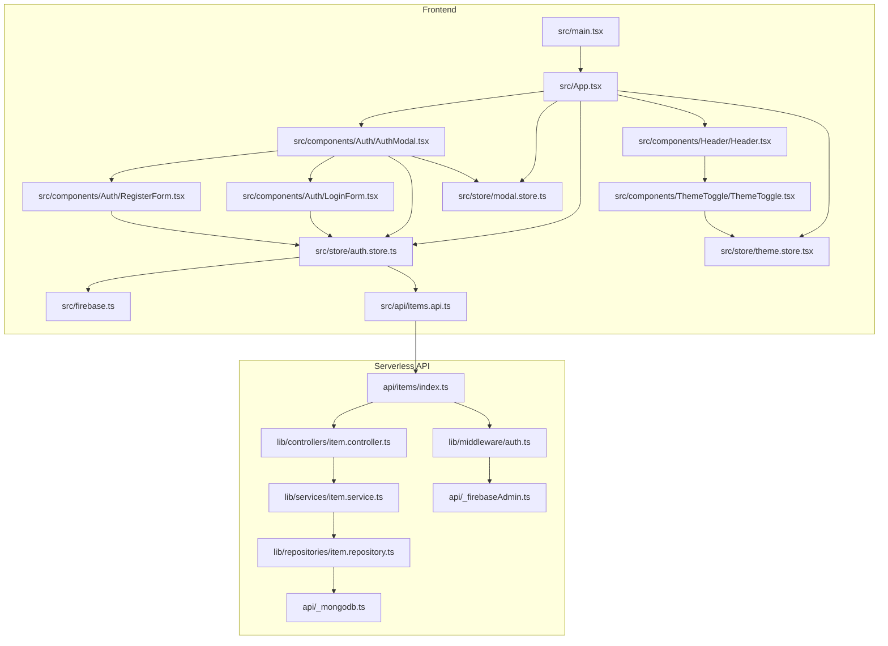
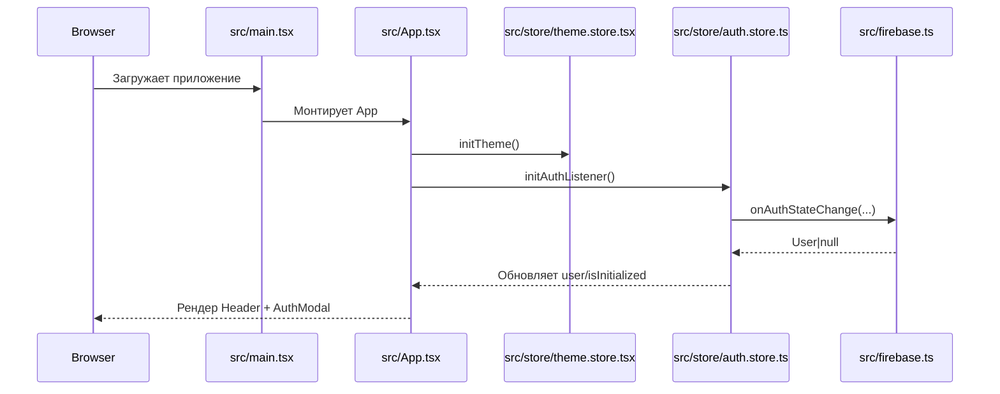
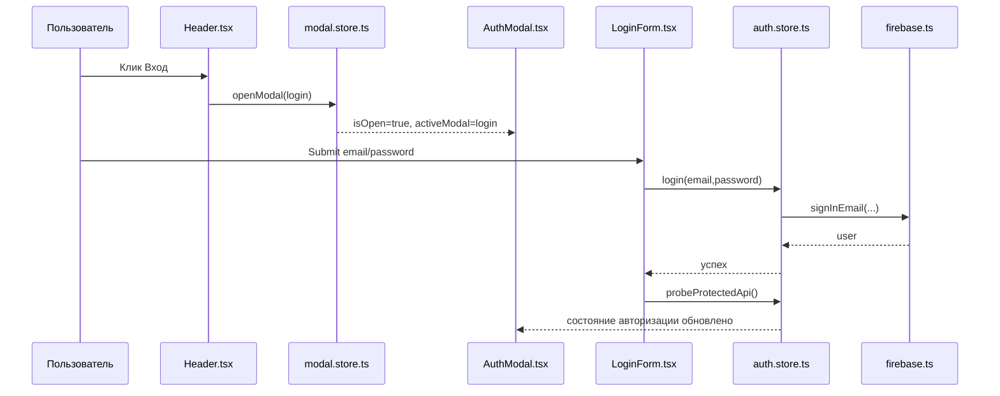
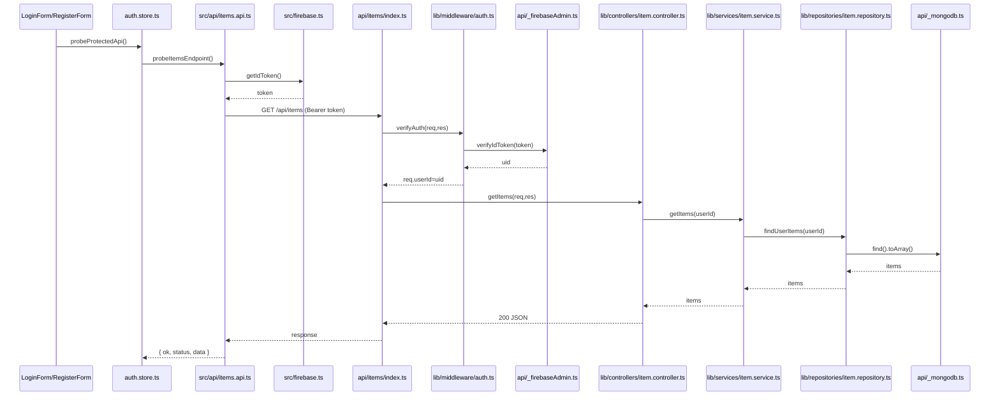

# Визуальная карта исполнения проекта

Документ отвечает на 3 вопроса:

- Что делает каждый ключевой файл
- Кто кого вызывает
- Как идет исполнение по шагам

## 1) Карта слоев и связей

## 2) Кто вызывает кого

### Точка входа

- src/main.tsx
  - вызывает рендер React и монтирует src/App.tsx

### Корневой компонент

- src/App.tsx
  - рендерит src/components/Header/Header.tsx
  - рендерит src/components/Auth/AuthModal.tsx
  - вызывает useThemeStore().initTheme()
  - вызывает useAuthStore().initAuthListener()
  - передает в Header колбэки onOpenLogin/onOpenRegister, которые вызывают useModalStore().openModal(...)

### Шапка

- src/components/Header/Header.tsx
  - показывает публичное/приватное меню из src/config/site.config.ts
  - при клике Вход/Регистрация вызывает колбэки из App
  - при клике Выход вызывает onLogout (это useAuthStore().logout)
  - использует src/components/ThemeToggle/ThemeToggle.tsx

### Модалка авторизации

- src/components/Auth/AuthModal.tsx
  - берет состояние модалки из src/store/modal.store.ts
  - берет clearError из src/store/auth.store.ts
  - в зависимости от activeModal рендерит LoginForm или RegisterForm

### Формы

- src/components/Auth/LoginForm.tsx
  - вызывает useAuthStore().login
  - затем вызывает useAuthStore().probeProtectedApi
- src/components/Auth/RegisterForm.tsx
  - вызывает useAuthStore().register
  - затем вызывает useAuthStore().probeProtectedApi

### Auth store

- src/store/auth.store.ts
  - initAuthListener использует onAuthStateChange из src/firebase.ts
  - login/register/logout используют функции из src/firebase.ts
  - probeProtectedApi вызывает src/api/items.api.ts

### Frontend API клиент

- src/api/items.api.ts
  - берет токен через getIdToken из src/firebase.ts
  - отправляет GET /api/items с Authorization: Bearer <token>

### Backend цепочка

- api/items/index.ts
  - вызывает verifyAuth из lib/middleware/auth.ts
  - маршрутизирует методы в lib/controllers/item.controller.ts
- lib/controllers/item.controller.ts
  - валидирует запросы
  - вызывает lib/services/item.service.ts
- lib/services/item.service.ts
  - формирует данные и вызывает lib/repositories/item.repository.ts
- lib/repositories/item.repository.ts
  - делает CRUD в MongoDB через api/\_mongodb.ts

## 3) Сценарий: запуск приложения

## 4) Сценарий: вход пользователя

## 5) Сценарий: защищенный запрос к API

## 6) Как пользоваться этой картой в обучении

1. Если неясно, где начинается процесс: смотреть сначала диаграмму из раздела 3.
2. Если непонятно, почему не открывается форма входа: смотреть раздел 4 и цепочку Header -> modal.store -> AuthModal.
3. Если непонятно, почему API возвращает 401: смотреть раздел 5 и проверять участок ItemsApi -> verifyAuth -> firebaseAdmin.
4. Если нужно понять ответственность файла: смотреть раздел 2 (кто вызывает кого).
