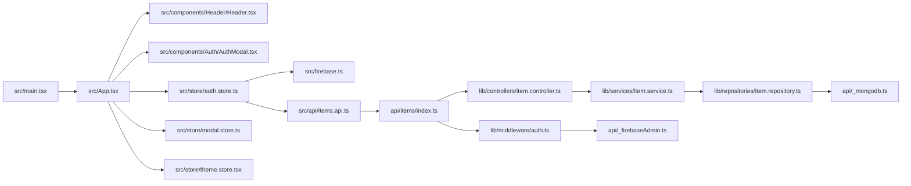

# Карта связей файлов проекта

Этот файл нужен как «шпаргалка по архитектуре»: что за что отвечает и как данные текут по приложению.

## 1) Общий поток данных

## 2) Роли слоев

- UI слой (компоненты React): отображает экран и вызывает действия store.
- Store слой (Zustand): хранит состояние приложения и бизнес-сценарии UI.
- API-клиент на фронте: делает HTTP-запросы к serverless API.
- API слой (Vercel function): принимает HTTP, проверяет авторизацию, маршрутизирует по методам.
- Controller: валидирует входные данные и собирает HTTP-ответ.
- Service: бизнес-логика между controller и repository.
- Repository: прямой доступ к MongoDB.

## 3) Что делает каждый ключевой файл

### Frontend

- src/main.tsx: точка входа React-приложения, подключает Router и App.
- src/App.tsx: связывает Header, AuthModal и Zustand store.
- src/components/Header/Header.tsx: UI шапки, навигация, вход/выход, состояние меню.
- src/store/auth.store.ts: логика авторизации, состояние пользователя, инициализация сессии.
- src/firebase.ts: инициализация Firebase и auth-операции (login/register/logout/getIdToken).
- src/api/items.api.ts: пример защищенного запроса к /api/items с Bearer токеном.
- src/config/site.config.ts: конфиг пунктов меню для гостя и авторизованного пользователя.

### Backend (serverless)

- api/items/index.ts: единая HTTP-точка /api/items (GET/POST/PATCH/DELETE).
- lib/middleware/auth.ts: проверяет Firebase ID token и записывает req.userId.
- lib/controllers/item.controller.ts: валидация + формирование HTTP-ответов.
- lib/services/item.service.ts: бизнес-операции с item.
- lib/repositories/item.repository.ts: CRUD в MongoDB.
- api/\_mongodb.ts: подключение к базе и выдача коллекций.
- api/\_firebaseAdmin.ts: Firebase Admin SDK для серверной верификации токена.

## 4) Как читать проект по шагам

1. Сначала открой src/main.tsx и src/App.tsx, чтобы понять старт приложения.
2. Потом src/store/auth.store.ts и src/firebase.ts, чтобы понять авторизацию.
3. Дальше src/components/Header/Header.tsx, чтобы увидеть, как UI использует auth state.
4. Затем src/api/items.api.ts и api/items/index.ts, чтобы увидеть фронт-бэк связку.
5. После этого lib/controllers -> lib/services -> lib/repositories.

## 5) Типичный сценарий (вход + защищенный API)

1. Пользователь входит через форму (AuthModal).
2. auth.store вызывает функцию входа из firebase.ts.
3. Firebase меняет auth state, store обновляет user.
4. При вызове защищенного API фронт берет токен из firebase.ts.
5. Токен уходит в Authorization: Bearer <token>.
6. backend middleware verifyAuth проверяет токен через Firebase Admin.
7. Контроллер вызывает сервис.
8. Сервис вызывает репозиторий.
9. Репозиторий работает с MongoDB и возвращает результат вверх по слоям.

## 6) Быстрый чек: «где что искать»

- «Почему кнопка Вход ничего не открывает?» -> Header + modal.store + AuthModal.
- «Почему пользователь как будто не авторизован после перезагрузки?» -> auth.store initAuthListener + firebase.ts.
- «Почему /api/items возвращает 401?» -> src/api/items.api.ts + lib/middleware/auth.ts + api/\_firebaseAdmin.ts.
- «Почему данные не сохранились в БД?» -> item.controller -> item.service -> item.repository -> \_mongodb.
