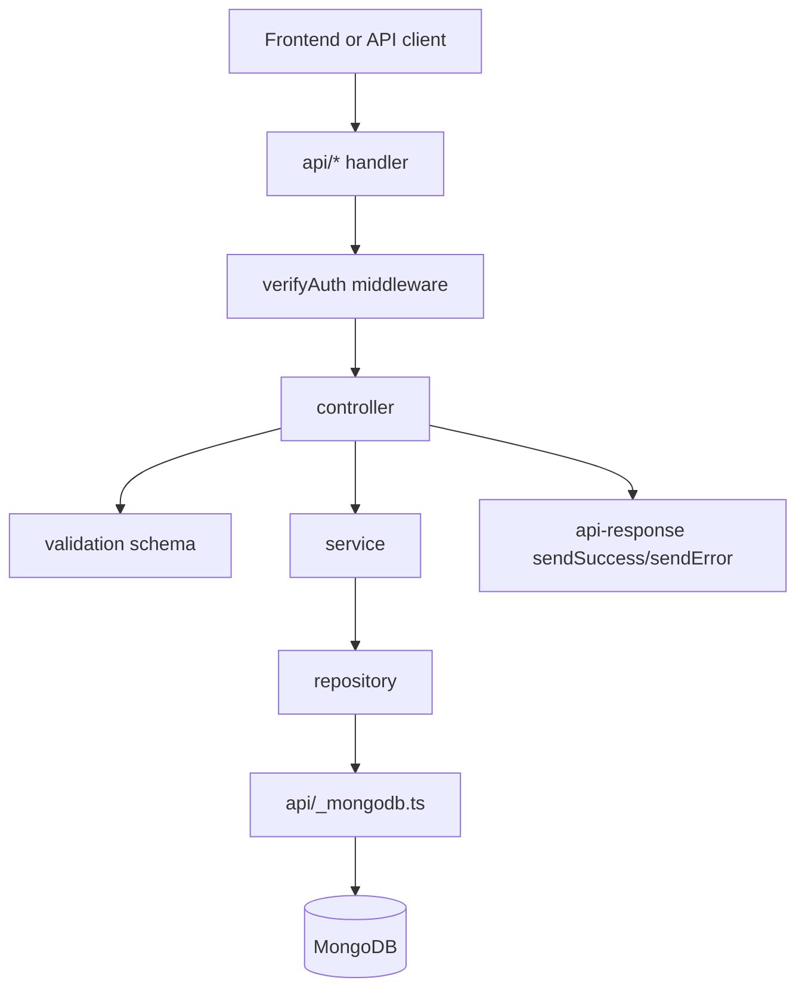
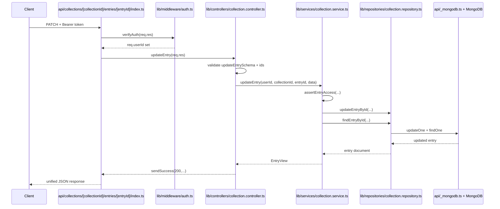

# Учебная карта проекта (простыми словами)

Этот файл объясняет проект как «карту города»: где какая зона, что там происходит, и по какой цепочке идет запрос.

Главная идея: в проекте почти нет настоящих дублей. Похожие файлы есть специально, потому что каждый слой делает свою часть работы.

## 1) Что за что отвечает (по папкам)

## Корень проекта

- `package.json`: список библиотек и команды (`dev`, `build`, `test`, `docs:*`).
- `vite.config.ts`: как запускается и собирается фронтенд.
- `tsconfig*.json`: правила TypeScript.
- `eslint.config.js`: правила качества кода.
- `DOCS_FILE_MAP.md`, `DOCS_EXECUTION_VISUAL.md`, `DOCS_AUTH_DB.md`: уже готовые тех-документы.
- `Plan.md`: рабочий план разработки.
- `SMOKE_CHECK_RESULTS.md`: результаты smoke-проверок.

Служебные папки:
- `.git`: история git.
- `.github`: обычно автоматизации/CI.
- `.vscode`: настройки редактора.
- `node_modules`: установленные пакеты.
- `dist`: результат сборки.

## Папка `api` (точки входа на сервер)

Это входные двери для HTTP-запросов. Здесь почти нет бизнес-логики.

- `api/collections/index.ts`
  - Что делает: обрабатывает `/api/collections` (GET, POST).
  - Кого вызывает: `verifyAuth` -> `collection.controller`.
- `api/collections/[collectionId]/index.ts`
  - Что делает: обрабатывает одну коллекцию (GET, PATCH, DELETE).
  - Кого вызывает: `verifyAuth` -> `collection.controller`.
- `api/collections/[collectionId]/entries/index.ts`
  - Что делает: список записей коллекции и создание записи (GET, POST).
  - Кого вызывает: `verifyAuth` -> `collection.controller`.
- `api/collections/[collectionId]/entries/[entryId]/index.ts`
  - Что делает: изменение/удаление одной записи (PATCH, DELETE).
  - Кого вызывает: `verifyAuth` -> `collection.controller`.
- `api/items/index.ts`
  - Что делает: CRUD для `/api/items` (GET, POST, PATCH, DELETE).
  - Кого вызывает: `verifyAuth` -> `item.controller`.
- `api/examples/collections/index.ts`
  - Что делает: публичные примеры коллекций (GET).
  - Важно: без `verifyAuth`.
- `api/_mongodb.ts`
  - Что делает: подключение к MongoDB, кеш соединения, выдача коллекций.
- `api/_firebaseAdmin.ts`
  - Что делает: серверная проверка Firebase токена.

## Папка `lib` (вся основная логика)

### `lib/middleware`

- `lib/middleware/auth.ts`
  - Что делает: проверяет токен в `Authorization`.
  - Результат: если токен валидный, пишет `req.userId`; если нет, сразу 401.

### `lib/http`

- `lib/http/api-response.ts`
  - Что делает: единый формат ответов.
  - Почему важно: все ответы API выглядят одинаково (`ok/data` или `ok/error`).
  - Дополнительно: нормализует query и форматирует ошибки валидации.

### `lib/controllers`

Контроллер = «диспетчер запроса».

- `lib/controllers/collection.controller.ts`
  - Что делает: читает параметры/тело запроса, валидирует, вызывает сервис.
  - Функции: `getCollections`, `createCollection`, `getCollection`, `updateCollection`, `deleteCollection`, `getEntries`, `createEntry`, `updateEntry`, `deleteEntry`, `getPublicCollections`.
- `lib/controllers/item.controller.ts`
  - Что делает: то же для `items`.
  - Функции: `getItems`, `createItem`, `updateItem`, `deleteItem`.
- `lib/controllers/controller-error.ts`
  - Что делает: превращает разные ошибки в правильные HTTP-статусы (422/403/404/500).

### `lib/validation`

- `lib/validation/collection.schema.ts`
  - Что делает: проверяет данные для коллекций/entries (через Zod).
- `lib/validation/item.schema.ts`
  - Что делает: проверяет данные для items.
- `lib/validation/collection.schema.test.ts`
  - Что проверяет: что приватные поля нельзя передавать снаружи.

### `lib/services`

Сервис = «бизнес-правила».

- `lib/services/collection.service.ts`
  - Что делает:
    - проверяет доступ к коллекции/entry (`assertCollectionAccess`, `assertEntryAccess`),
    - выполняет транзакции,
    - преобразует поля (например цена в центы и обратно),
    - собирает ответ в формат API (`CollectionView`, `EntryView`).
- `lib/services/item.service.ts`
  - Что делает: правила для items (создать/получить/обновить/удалить).
- `lib/services/collection.service.test.ts`
  - Что проверяет: бизнес-логику и транзакции `collection.service`.

### `lib/repositories`

Репозиторий = «чистая работа с базой».

- `lib/repositories/collection.repository.ts`
  - Что делает: MongoDB-запросы для collections и entries (поиск, фильтры, сортировка, пагинация, update, delete).
- `lib/repositories/item.repository.ts`
  - Что делает: MongoDB-запросы для items.

### `lib/types`

- `lib/types/collection.types.ts`: типы коллекций/entries, сортировок, ответов.
- `lib/types/item.types.ts`: типы item и DTO.
- `lib/types/request.types.ts`: расширенный запрос с `userId` после auth.

## Папка `src` (только то, что вам интересно)

- `src/api/items.api.ts`
  - Что делает: пробный защищенный запрос на `/api/items`.
  - Зачем: быстро проверить, что токен берется и API доступно.
  - Важно: это пока smoke-клиент, а не полный фронтовый SDK для всех endpoint.

## Папка `Docs`

Это зеркало документации к коду.

Пример:
- код: `lib/services/collection.service.ts`
- документация: `Docs/lib/services/collection.service.ts.md`

Поэтому иногда кажется, что «дубли», но это не дубли логики, а дубли описаний.

## Папка `scripts`

- `scripts/docs-scaffold.mjs`: создает шаблоны markdown-доков для исходников.
- `scripts/docs-check.mjs`: проверяет, что docs не отстали от измененного кода.

## Папка `smoke`

- `smoke/step-2.2.8.api.smoke.test.ts`: интеграционная проверка основных сценариев API (авторизация, валидация, статусы).

## Папка `public`

Статические файлы для фронта (изображения, иконки и т.д.).

---

## 2) Почему кажется, что функции делают одно и то же

Это нормальное ощущение. Здесь одинаковый «шаблон вызовов», но разные роли:

- Handler (в `api/*`): принимает HTTP-метод и передает дальше.
- Middleware (`auth.ts`): проверяет токен.
- Controller: разбирает и валидирует входные данные, формирует HTTP-ответ.
- Service: применяет бизнес-правила и проверки доступа.
- Repository: делает запросы к MongoDB.
- DB helper (`_mongodb.ts`): держит подключение и отдает коллекции.

Похоже по форме, но не по задаче.

---

## 3) Цепочка вызова наглядно (общая)

Для публичного endpoint `api/examples/collections` шаг `verifyAuth` пропускается.

---

## 4) Цепочки по каждому маршруту

## Коллекции

- `GET /api/collections`
  - `api/collections/index.ts` -> `verifyAuth` -> `collection.controller.getCollections`
  - далее -> `collection.service.getOwnerCollections`
  - далее -> `collection.repository.findOwnerCollections`
  - далее -> `api/_mongodb.ts` -> MongoDB `collections`

- `POST /api/collections`
  - `api/collections/index.ts` -> `verifyAuth` -> `collection.controller.createCollection`
  - валидация: `createCollectionSchema`
  - далее -> `collection.service.createCollection`
  - далее -> `collection.repository.createCollection` + `findCollectionById`

## Одна коллекция

- `GET /api/collections/[collectionId]`
  - handler -> auth -> `collection.controller.getCollection`
  - далее -> `collection.service.getCollectionById`
  - внутри проверка доступа: `assertCollectionAccess`
  - далее -> `collection.repository.findCollectionById` (или raw-проверка)

- `PATCH /api/collections/[collectionId]`
  - handler -> auth -> `collection.controller.updateCollection`
  - валидация: `updateCollectionSchema`
  - далее -> `collection.service.updateCollection`
  - далее -> `collection.repository.updateCollectionById` -> `findCollectionById`

- `DELETE /api/collections/[collectionId]`
  - handler -> auth -> `collection.controller.deleteCollection`
  - далее -> `collection.service.deleteCollection`
  - внутри транзакция:
    - `deleteEntriesByCollectionId`
    - `deleteCollectionById`

## Записи внутри коллекции (entries)

- `GET /api/collections/[collectionId]/entries`
  - handler -> auth -> `collection.controller.getEntries`
  - валидация: `entryListQuerySchema`
  - далее -> `collection.service.getCollectionEntries`
  - далее -> `collection.repository.findCollectionEntries`

- `POST /api/collections/[collectionId]/entries`
  - handler -> auth -> `collection.controller.createEntry`
  - валидация: `createEntrySchema`
  - далее -> `collection.service.createEntry`
  - внутри транзакция:
    - `collection.repository.createEntry`
    - `changeCollectionEntriesCount(+1)`

- `PATCH /api/collections/[collectionId]/entries/[entryId]`
  - handler -> auth -> `collection.controller.updateEntry`
  - валидация: `updateEntrySchema`
  - далее -> `collection.service.updateEntry`
  - далее -> `collection.repository.updateEntryById` -> `findEntryById`

- `DELETE /api/collections/[collectionId]/entries/[entryId]`
  - handler -> auth -> `collection.controller.deleteEntry`
  - далее -> `collection.service.deleteEntry`
  - внутри транзакция:
    - `collection.repository.deleteEntryById`
    - `changeCollectionEntriesCount(-1)`

## Items

- `GET /api/items`
  - `api/items/index.ts` -> auth -> `item.controller.getItems`
  - далее -> `item.service.getItems`
  - далее -> `item.repository.findUserItems`

- `POST /api/items`
  - handler -> auth -> `item.controller.createItem`
  - валидация: `createItemSchema`
  - далее -> `item.service.createNewItem`
  - далее -> `item.repository.createItem`

- `PATCH /api/items?id=...`
  - handler -> auth -> `item.controller.updateItem`
  - валидация: `updateItemSchema` + `itemIdSchema`
  - далее -> `item.service.updateExistingItem`
  - далее -> `item.repository.updateItem`

- `DELETE /api/items?id=...`
  - handler -> auth -> `item.controller.deleteItem`
  - валидация id: `itemIdSchema`
  - далее -> `item.service.removeItem`
  - далее -> `item.repository.deleteItem`

## Публичные примеры

- `GET /api/examples/collections`
  - `api/examples/collections/index.ts` -> `collection.controller.getPublicCollections`
  - далее -> `collection.service.getPublicCollections`
  - далее -> `collection.repository.findPublicCollections`

---

## 5) Отдельно: как фронт трогает бэкенд сейчас

Файл `src/api/items.api.ts` делает только проверочный вызов:

1. Берет токен из `src/firebase.ts`.
2. Отправляет `GET /api/items` с `Authorization: Bearer <token>`.
3. Возвращает `{ ok, status, data }`.

Это не полный API-клиент приложения, а «проверка здоровья» защищенного endpoint.

---

## 6) Наглядная цепочка для одного реального запроса

Пример: `PATCH /api/collections/[collectionId]/entries/[entryId]`

---

## 7) Где смотреть, если что-то ломается

- Всегда 401:
  - `lib/middleware/auth.ts`
  - `api/_firebaseAdmin.ts`
  - заголовок `Authorization` во фронтовом запросе.

- Всегда 422 (валидация):
  - `lib/validation/collection.schema.ts`
  - `lib/validation/item.schema.ts`
  - соответствующий controller.

- Запрос проходит, но данных нет:
  - соответствующий repository (`collection.repository.ts` или `item.repository.ts`).
  - фильтры ownerId/collectionId.

- Ответы «разные по форме»:
  - `lib/http/api-response.ts` (должен быть единый формат).

---

## 8) Короткий итог

Архитектура здесь сложнее «простого fetch + один серверный файл», но это сделано, чтобы проект было легче расширять:

- легче тестировать,
- легче искать ошибки,
- легче добавлять новые endpoint,
- меньше риск случайно смешать авторизацию, бизнес-правила и SQL/NoSQL-запросы в одном месте.

Если хотите, следующий шаг я могу сделать как «маршрут по файлам на 30 минут»: в каком порядке открывать файлы, чтобы быстро начать уверенно ориентироваться в проекте.
